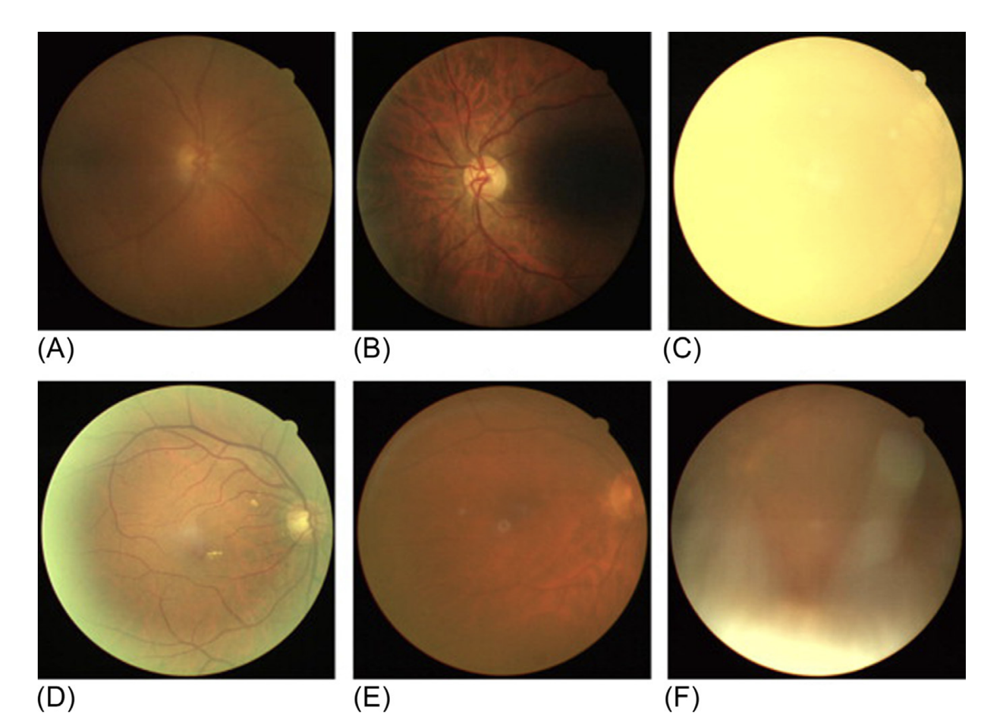

# IQA for Retinal Fundus Images

### Rodrigo de Castro Michelassi
### Instituto de Matemática e Estatística da Universidade de São Paulo (IME-USP)

## General

Research project being developed for the University of São Paulo, in Brasil, aiming to classify correctly the quality label of an eye-fundus images using Convolutional Neural Networks. This project is currently using the brazilian dataset BRSet, put together by the Federal University of São Paulo, putting Brazil on the spot for Ophthalmology research.

This project was first proposed at University of São Paulo Medical School (FMUSP), in which the final goal is to detect possible causes for Cognitive Decline, and Diabetes is one of the research scopes. On top of that, Computer Science students at IME-USP are being responsible for developing a deep learning algorithm capable of recognizing eye diseases, including Diabetic Retinopathy, really common on people with diabetes, and this classification should be held into account on the Cognitive Decline research.

  
 
To optimize the results on the eye diseases classification problem and guarantee that no meaningful information to detect an eye disease is missing on the image, causing no harm to the feature extraction process, it is really important to assess the quality of the images used.

The quality classification is made based on the following metrics:

> Focus: is the focus good enough to perform proper classification on smaller retinal injuries?
>
> Illumination: is the image illumination adequate? (Not too dark, not too bright)
>
> Image Field: does the image field includes all of the optic nerve head and macula?
>
> Artifacts: is the image free of artifacts, such as dust, arch deffects, eyelashes images, lens reflex etc.?
>
> Adequate: the above metrics are not meaningful on the image

and we aim to classify the images between <b>Inadequate</b> (when the image present any of the above metrics) or <b>Adequate</b> (the image does not present any of the above metrics, and is good enough for abnormalities recognition).

## Images Preview

Examples of impaired/ungradable images. (A) Poor focus and clarity due to overall haze. (B) Poor macula visibility due to uneven illumination. (C) Poor optic disc visibility due to total blink. (D) Edge haze due to pupillary restriction. (E) Dust and dirt artifacts on the lens image capture system (near the center). (F) Lash artifact.

## Pre-processing and fine tuning

## Model training details

## Results

## Files description

## References
