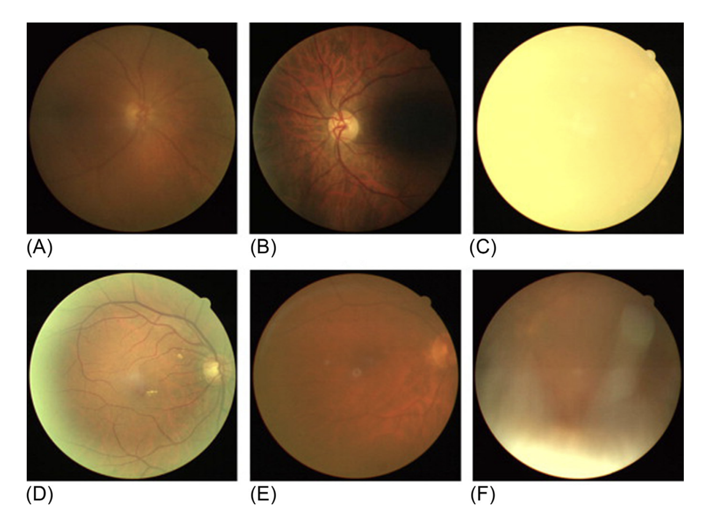
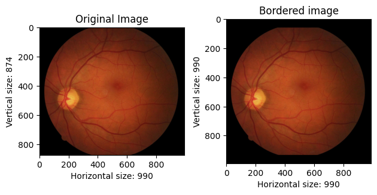
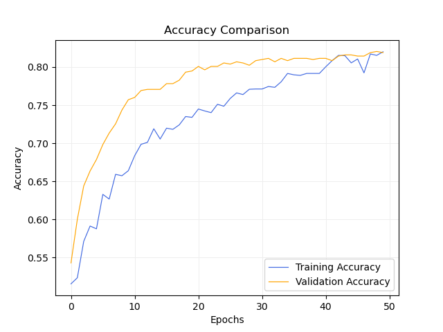
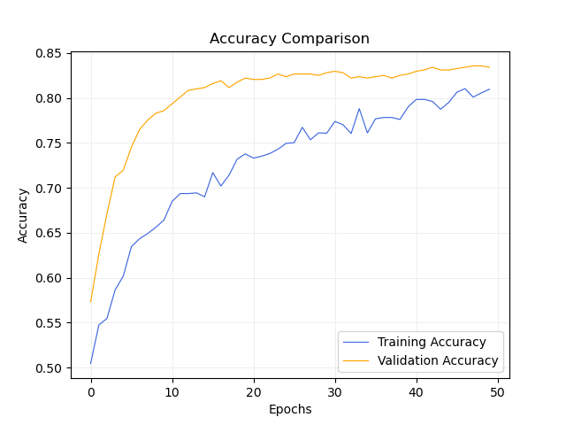
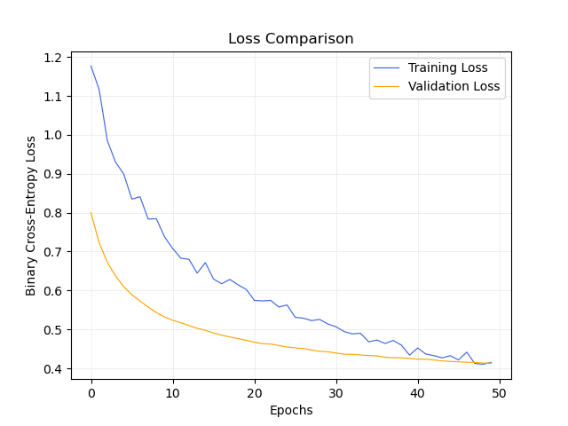
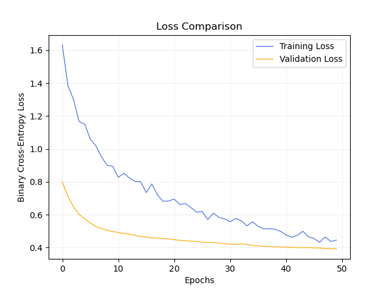

# IQA for Retinal Fundus Images

### Rodrigo de Castro Michelassi
### Instituto de Matemática e Estatística da Universidade de São Paulo (IME-USP)

## General

<p align="justify">Research project developed for the University of São Paulo, in Brasil, aiming to classify correctly the quality label of an eye-fundus images using Convolutional Neural Networks. This project was based on the brazilian dataset BRSet, put together by the Federal University of São Paulo, taking Brazil to the spotlight for Ophthalmology research; and the EyeQ dataset, a famous public dataset for IQA in eye fundus images.</p>

<p align="justify">This project was first proposed at University of São Paulo Medical School (FMUSP), in which the final goal is to detect possible causes for Cognitive Decline, and Diabetes is one of the research scopes. On top of that, Computer Science students at IME-USP are being responsible for developing a deep learning algorithm capable of recognizing eye diseases, including Diabetic Retinopathy, really common on people with diabetes, and this classification should be held into account on the Cognitive Decline research.</p>
  
 <p align="justify">In order to optimize the results on the eye diseases classification problem and guarantee that no meaningful information to detect an eye disease is missing on the image, causing no harm to the feature extraction process, it is really important to assess the quality of the images used.</p>

## Labeling process

<p align="justify">The quality classification on BRSet is made based on the following metrics:</p>

> <b>Focus:</b> This parameter is graded as adequate when the focus is sufficient to identify third-generation branches within one optic disc diameter around the macula.
>
> <b>Illumination:</b> This parameter is graded as adequate when both of the following requirements are met:
> 
> 1) Absence of dark, bright, or washed-out areas that interfere with detailed grading;
>
> 2) In the case of peripheral shadows (e.g., due to pupillary constriction) the readable part should reach more than 80% of the whole image.
>
> <b>Image Field:</b> This parameter is graded as adequate when all the following requirements are met:
>
> 1) The optic disc is at least 1 disc diameter (DD) from the nasal edge;
> 
> 2) The macular center is at least 2 DD from the temporal edge;
> 
> 3) The superior and inferior temporal arcades are visible in a length of at least 2 DD
>
> <b>Artifacts:</b> The following artifacts are considered: haze, dust, and dirt. This parameter is graded as adequate when the image is sufficiently artifact-free to allow adequate grading.

<p align="justify">and we aim to classify the images between <b>Inadequate</b> (when the image present any of the above metrics) or <b>Adequate</b> (the image does not present any of the above metrics, and is good enough for abnormalities recognition).</p>

## Images Preview
<p align="center"></p>
<p align="center">Fig. 1: Examples of impaired/ungradable images. (A) Poor focus and clarity due to overall haze. (B) Poor macula visibility due to uneven illumination. (C) Poor optic disc visibility due to total blink. (D) Edge haze due to pupillary restriction. (E) Dust and dirt artifacts on the lens image capture system (near the center). (F) Lash artifact.</p>

## Pre-processing

<p align="justfify">Since this is an image quality assessment problem and we may not be able to train a model using the image on its original dimensions, there must be enough care to lose the minimum information possible. In order to do that, a decision to keep the aspect ratio of the image was made when redimensioning it, but it would lose some part of the image and affect the Image Field metric. To avoid this problem, since the background of all images is full on black, a simple solution was to increase a black background on the top and bottom parts, in order to make the image squared.</p>

<p align="center"></p>
<p align="center">Fig. 2: Before and after adding black border to eye fundus image</p>

<p align="justfify">We are going to see later on that this problem was also approached by a Transfer Learning point of view, so, in order to get better accuracy and results, for all the pre-trained CNNs used, we decide to use its own normalization strategy.</p>

```
from tensorflow.keras.applications.resnet50 import preprocess_input

def normalize(image, label):
    image = preprocess_input(image)
    return image, label    
```

## Data Division

<p align="justify">The main problem we attempted to solve was the data division. Since we are working on an binary classification problem, we must be able to make a model that is equally good on predicting each class. By using BRSet with all its data was actually impossible to perform good in such task, since the dataset is completely unbalanced for the IQA problem. The original data is supported on $88\%$ of the images being Adequate, and only $12\%$ being Inadequate.</p>

<p align="justify">With that stated, we lost a lot of data to be able to train a great model, our data division became the following:</p>

|             | Adequate | Inadequate | Balance [Adequates] |
| --------    | -------  | ------- | ------- |
| Training    | 1315     | 1424    | 48%    |
| Testing     | 1413      | 213    | 87%    |
| Validation  | 316     | 347    | 47%    |

<p align="justify">Not having as much data to train in an actual problem, and in order to try and get better results, we decided to train the EyeQ dataset and fine tune it to BRSet. As a matter of fact, we got excellent results on the EyeQ dataset, but it did not generalize greatly for our brazilian eye fundus dataset when fine tuning. We are going to see further ahead the results concerning the BRSet, on this configuration, and the EyeQ in general, but not the fine-tuning process from EyeQ to BRSet.</p>

## Results

<p align="justify">Several pre-trained CNNs were tested on this problem, such as VGG16 and Inception-V3, but Resnet50 has outperformed all of them in terms of accuracy, precision, recall and ROC-AUC. The training process was: </p>

> 1. Loading the pre-trained CNN, without the top
> 2. Freezing the convolutional layers
> 3. Adding new fully connected layers

<p align="justify">The $2$ new fully connected layers have, respectively, $512$ and $2$ nodes, and uses the ReLU activation function ($f(u) =$ $max$ ($0, u$)) in between layers. On the last layer, we use the softmax activation function.</p>

<b>Results on BRSet validation (balanced data)</b>

| Metric        | Value              |
|---------------|--------------------|
| **Accuracy**  | 0.8536             |
| **AUC**       | 0.9242             |
| **Precision** | 0.86 (Inadequate) / 0.85 (Adequate) |
| **Recall**    | 0.86 (Inadequate) / 0.85 (Adequate) |

<b>Results on BRSet test (unbalanced data)</b>

| Metric        | Value              |
|---------------|--------------------|
| **Accuracy**  | 0.8685             |
| **AUC**       | 0.8942             |
| **Precision** | 0.50 (Inadequate) / 0.95 (Adequate) |
| **Recall**    | 0.72 (Inadequate) / 0.89 (Adequate) |

<b>Results on EyeQ test</b>

| Metric        | Value              |
|---------------|--------------------|
| **Accuracy**  | 0.9409             |
| **AUC**       | 0.9842             |
| **Precision** | 0.95 (Inadequate) / 0.94 (Adequate) |
| **Recall**    | 0.91 (Inadequate) / 0.97 (Adequate) |

By observing the results obtained, the model performed great on EyeQ, with all metrics with more than $90\%$ score, but it did not perform greatly when tested on BRSet using the unbalanced test dataset, as described above. In general, the model is great but it would need more data to get a better performance on a real-life scenario.

## Observations

<p align="justify">During a LEARN reunion, a pitch idea was proposed by my advisor, based on some experiments one of her PHD candidates made, where he claimed to have had better accuracy on his model (that was early-stopped) by switching the final fully connected layer, from the sigmoid function to the softmax function, and therefore changing the labels format from binary to one-hot encoded.</p>

<p align="justify">When running the same experiments on this problem, I have noticed that I was actually getting a better performance using the softmax activation function, not really related to accuracy, but related to the number of epochs necessary to converge to the answer, as the following graphics show:</p>

<p float="left">
  
  
</p>
<p align="center" style="font-size:0.5em;">Fig. 3/Fig. 4: Accuracy evolution using sigmoid/softmax, respectively</p>

<p float="left">
  
  
</p>
<p align="center" style="font-size:0.5em;">Fig. 3/Fig. 4: Loss evolution using sigmoid/softmax, respectively</p>

<p align="justify">As it is possible to see, the model tends to converge faster using softmax. As for right now I have not yet tested it more often and ran statistical models in order to confirm that this holds on most of the cases, but it is a quite interesting result :)</p>

## References
[1] Wang, Z., Bovik, A. C., and Lu, L. (2002). Why is image quality assessment so
difficult? In 2002 IEEE International Conference on Acoustics, Speech, and Signal
Processing, volume 4, pages IV–3313–IV–3316.

[2] Athar, S. and Wang, Z. (2019). A comprehensive performance evaluation of image
quality assessment algorithms. IEEE Access, 7:140030–140070.

[3] Bosse, S., Maniry, D., Wiegand, T., and Samek, W. (2016). A deep neural network for
image quality assessment. In 2016 IEEE International Conference on Image Processing
(ICIP), pages 3773–3777.

[4] Yang, J., Lyu, M., Qi, Z., and Shi, Y. (2023). Deep learning based image quality
assessment: A survey. Procedia Computer Science, 221:1000–1005. Tenth International
Conference on Information Technology and Quantitative Management (ITQM 2023).

[5] Mariana Batista Gonçalves, Luis Filipe Nakayama, Daniel Ferraz, Hanna Faber,
Edward Korot, Fernando Korn Malerbi, Caio Vinic ius Regatieri, Mauricio Maia,
Leo Anthony Celi, Pearse A. Keane, and Rub ens Belfort Jr. Image quality assessment
of retinal fundus photographs for diabetic retinopathy in the machine learning era:
a review. Eye, 2023.

[6] L. F. Nakayama, M. Goncalves, L. Zago Ribeiro, H. San tos, D. Ferraz, F. Malerbi,
L. A. Celi,and C. Regatieri. A brazilian multilabel ophthalmological dataset (BRSET)

[7] Huazhu Fu, Boyang Wang, Jianbing Shen, Shanshan Cui, Yanwu Xu, Jiang Liu, Ling Shao. 
Evaluation of Retinal Image Quality Assessment Networks in Different Color-spaces, in MICCAI, 2019.

[8] Bolla, M., Biswas, S. and Palanisamy, R. (2023) Deep Learning Based Quality Prediction of Retinal Fundus Images. Current Directions in Biomedical Engineering, Vol. 9 (Issue 1), pp. 706-709.
